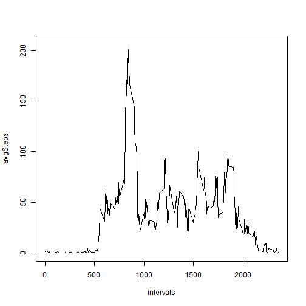

 This is an analysis of the the step data collected over a period 
 of 61 days
 
 Function Block

 getStats - takes a dataframe and calculates the mean, median and sum of the steps column. It throws out any observation with zero steps. It returns a character vector with the three values
 
 convertToDF - takes a list of character vectors and converts them to a dataframe

```r
getStats <- function(x) {
        day <- x[1,2]
        steps <- length(x$steps)
        #zeros <- nrow(x[which(x$steps == 0),])
        intervalsWithSteps <- x[which(x$steps != 0),]
        meanSteps <- mean(intervalsWithSteps$steps)
        theMedian <- median(intervalsWithSteps$steps)
        theSum <- sum(intervalsWithSteps$steps)
        c(date=day,mean=meanSteps,median=theMedian,total=theSum)
}

# convert list into dataframe
convertToDF <- function(x) {
        theDay <- character()
        theMean <- numeric()
        theMedian <- numeric()
        theSum <- numeric()
        for (i in daytotals) {
                df <- i
                names(df) <- NULL
                theDay <- append(theDay,df[1])
                theMean <- append(theMean,as.numeric(df[2]))
                theMedian <- append(theMedian,as.numeric(df[3]))
                theSum <- append(theSum,as.numeric(df[4]))
        }
        return(data.frame(day=theDay,mean=round(theMean,2),median=round(theMedian,2),Total=theSum,stringsAsFactors=F))
}
```


<b>Part 1 - Loading and preprocessing the data.</b>
<br>Edit the first line below to set the working directy to the location of the data file


```r
setwd("~/Dropbox/Coursera/JHDS/Rresearch")
data <- read.csv("activity.csv",stringsAsFactors=F)

# Check the data
dim(data)
```

```
## [1] 17568     3
```

```r
str(data)
```

```
## 'data.frame':	17568 obs. of  3 variables:
##  $ steps   : int  NA NA NA NA NA NA NA NA NA NA ...
##  $ date    : chr  "2012-10-01" "2012-10-01" "2012-10-01" "2012-10-01" ...
##  $ interval: int  0 5 10 15 20 25 30 35 40 45 ...
```
 Preprocess the data. For the first part of the analysis, I am splitting the data into two groups: one with complete cases and one without
 

```r
good <- complete.cases(data)
goodData <- data[good,]
badData <- data[!good,]
```
 How many days of good data?

```r
completeDays <- length(unique(goodData$date))
completeDays
```

```
## [1] 53
```
 <b>Part 2 - What is the mean total number of steps take per day?</b>
 
 Split the dataset by date


```r
days.list <- split(goodData,goodData$date)
```
 What is the mean total number of steps taken per day? The getStats function ignores zero days in the calculation. I did that to give meaningful numbers to the mean and median. Otherwise, they would have been close to or at zero for most days.

```r
daytotals <- lapply(days.list,getStats)
dfTotals <- convertToDF(daytotals)
```
Mean and median for each good day. 

```r
dfTotals
```

```
##           day   mean median Total
## 1  2012-10-02  63.00   63.0   126
## 2  2012-10-03 140.15   61.0 11352
## 3  2012-10-04 121.16   56.5 12116
## 4  2012-10-05 154.58   66.0 13294
## 5  2012-10-06 145.47   67.0 15420
## 6  2012-10-07 101.99   52.5 11015
## 7  2012-10-09 134.85   48.0 12811
## 8  2012-10-10  95.19   56.5  9900
## 9  2012-10-11 137.39   35.0 10304
## 10 2012-10-12 156.59   46.0 17382
## 11 2012-10-13 119.48   45.5 12426
## 12 2012-10-14 160.62   60.5 15098
## 13 2012-10-15 131.68   54.0 10139
## 14 2012-10-16 157.12   64.0 15084
## 15 2012-10-17 152.86   61.5 13452
## 16 2012-10-18 152.36   52.5 10056
## 17 2012-10-19 127.19   74.0 11829
## 18 2012-10-20 125.24   49.0 10395
## 19 2012-10-21  96.93   48.0  8821
## 20 2012-10-22 154.71   52.0 13460
## 21 2012-10-23 101.34   56.0  8918
## 22 2012-10-24 104.44   51.5  8355
## 23 2012-10-25  56.64   35.0  2492
## 24 2012-10-26  77.02   36.5  6778
## 25 2012-10-27 134.92   72.0 10119
## 26 2012-10-28 110.17   61.0 11458
## 27 2012-10-29  80.94   54.5  5018
## 28 2012-10-30 110.33   40.0  9819
## 29 2012-10-31 179.23   83.5 15414
## 30 2012-11-02 143.24   55.5 10600
## 31 2012-11-03 117.46   59.0 10571
## 32 2012-11-05 141.07   66.0 10439
## 33 2012-11-06 100.41   52.0  8334
## 34 2012-11-07 135.61   58.0 12883
## 35 2012-11-08  61.90   42.5  3219
## 36 2012-11-11 132.72   55.0 12608
## 37 2012-11-12 156.01   42.0 10765
## 38 2012-11-13  90.57   57.0  7336
## 39 2012-11-15  20.50   20.5    41
## 40 2012-11-16  89.20   43.0  5441
## 41 2012-11-17 183.83   65.5 14339
## 42 2012-11-18 162.47   80.0 15110
## 43 2012-11-19 117.88   34.0  8841
## 44 2012-11-20  95.15   58.0  4472
## 45 2012-11-21 188.04   55.0 12787
## 46 2012-11-22 177.63   65.0 20427
## 47 2012-11-23 252.31  113.0 21194
## 48 2012-11-24 176.56   65.5 14478
## 49 2012-11-25 140.88   84.0 11834
## 50 2012-11-26 128.30   53.0 11162
## 51 2012-11-27 158.67   57.0 13646
## 52 2012-11-28 212.15   70.0 10183
## 53 2012-11-29 110.11   44.5  7047
```
Histogram

```r
hist(dfTotals$Total,xlab="Interval",main="Steps per Interval (NAs removed) ",freq=T,breaks=20)
```

 
 <p>Part 3 What is the average daily activity
 

```r
avgSteps <- tapply(goodData$steps,goodData$interval,mean)
intervals <- as.integer(names(avgSteps))
plot(intervals,avgSteps,type="l")
```

 
<p>The inteval with the max number of steps is 835. The average number of steps take is 206 in this interval


```r
avgSteps[avgSteps == max(avgSteps)]
```

```
##   835 
## 206.2
```
<b>Part 4 Imputing missing values</b>

Look at the good data

```r
dim(goodData)
```

```
## [1] 15264     3
```

```r
str(goodData)
```

```
## 'data.frame':	15264 obs. of  3 variables:
##  $ steps   : int  0 0 0 0 0 0 0 0 0 0 ...
##  $ date    : chr  "2012-10-02" "2012-10-02" "2012-10-02" "2012-10-02" ...
##  $ interval: int  0 5 10 15 20 25 30 35 40 45 ...
```

```r
head(goodData)
```

```
##     steps       date interval
## 289     0 2012-10-02        0
## 290     0 2012-10-02        5
## 291     0 2012-10-02       10
## 292     0 2012-10-02       15
## 293     0 2012-10-02       20
## 294     0 2012-10-02       25
```
Look at the bad data

```r
dim(badData)
```

```
## [1] 2304    3
```

```r
str(badData)
```

```
## 'data.frame':	2304 obs. of  3 variables:
##  $ steps   : int  NA NA NA NA NA NA NA NA NA NA ...
##  $ date    : chr  "2012-10-01" "2012-10-01" "2012-10-01" "2012-10-01" ...
##  $ interval: int  0 5 10 15 20 25 30 35 40 45 ...
```

```r
head(badData)
```

```
##   steps       date interval
## 1    NA 2012-10-01        0
## 2    NA 2012-10-01        5
## 3    NA 2012-10-01       10
## 4    NA 2012-10-01       15
## 5    NA 2012-10-01       20
## 6    NA 2012-10-01       25
```
All the bad data seems to be in the steps column. Which days have no data?

```r
unique(badData$date)
```

```
## [1] "2012-10-01" "2012-10-08" "2012-11-01" "2012-11-04" "2012-11-09"
## [6] "2012-11-10" "2012-11-14" "2012-11-30"
```
Verify these dates are not id the good data

```r
setdiff(badData$date,goodData$date)
```

```
## [1] "2012-10-01" "2012-10-08" "2012-11-01" "2012-11-04" "2012-11-09"
## [6] "2012-11-10" "2012-11-14" "2012-11-30"
```
Total number of missing values

```r
missing <- nrow(badData)
```
Impute stratgy - use the 5 minute average and adjust the value using div/mod to find the floor/ceiling

```r
imputed <- sapply(avgSteps,function(x) {
        div <- x%/% 1
        mod <- x%% 1
        if(mod > 0.5) {
                div <- div + 1
        }
        return(div)
})
```
Add the imputed data to the badData frame. Since there are 8 days of bad data, just replicate the imputed data 8 times and apply it to the dataframe

```r
badData$steps <- rep(imputed,8)
head(badData,10)
```

```
##    steps       date interval
## 1      2 2012-10-01        0
## 2      0 2012-10-01        5
## 3      0 2012-10-01       10
## 4      0 2012-10-01       15
## 5      0 2012-10-01       20
## 6      2 2012-10-01       25
## 7      1 2012-10-01       30
## 8      1 2012-10-01       35
## 9      0 2012-10-01       40
## 10     1 2012-10-01       45
```
Create a new dataset with no missing values

```r
imputedData <- rbind(goodData,badData)
```
Get the median,mean and histogram

```r
days.list <- split(imputedData,imputedData$date)
daytotals <- lapply(days.list,getStats)
imputedTotals <- convertToDF(daytotals)
```
Mean,median and histogram

```r
imputedTotals
```

```
##           day   mean median Total
## 1  2012-10-01  43.75   40.5 10762
## 2  2012-10-02  63.00   63.0   126
## 3  2012-10-03 140.15   61.0 11352
## 4  2012-10-04 121.16   56.5 12116
## 5  2012-10-05 154.58   66.0 13294
## 6  2012-10-06 145.47   67.0 15420
## 7  2012-10-07 101.99   52.5 11015
## 8  2012-10-08  43.75   40.5 10762
## 9  2012-10-09 134.85   48.0 12811
## 10 2012-10-10  95.19   56.5  9900
## 11 2012-10-11 137.39   35.0 10304
## 12 2012-10-12 156.59   46.0 17382
## 13 2012-10-13 119.48   45.5 12426
## 14 2012-10-14 160.62   60.5 15098
## 15 2012-10-15 131.68   54.0 10139
## 16 2012-10-16 157.12   64.0 15084
## 17 2012-10-17 152.86   61.5 13452
## 18 2012-10-18 152.36   52.5 10056
## 19 2012-10-19 127.19   74.0 11829
## 20 2012-10-20 125.24   49.0 10395
## 21 2012-10-21  96.93   48.0  8821
## 22 2012-10-22 154.71   52.0 13460
## 23 2012-10-23 101.34   56.0  8918
## 24 2012-10-24 104.44   51.5  8355
## 25 2012-10-25  56.64   35.0  2492
## 26 2012-10-26  77.02   36.5  6778
## 27 2012-10-27 134.92   72.0 10119
## 28 2012-10-28 110.17   61.0 11458
## 29 2012-10-29  80.94   54.5  5018
## 30 2012-10-30 110.33   40.0  9819
## 31 2012-10-31 179.23   83.5 15414
## 32 2012-11-01  43.75   40.5 10762
## 33 2012-11-02 143.24   55.5 10600
## 34 2012-11-03 117.46   59.0 10571
## 35 2012-11-04  43.75   40.5 10762
## 36 2012-11-05 141.07   66.0 10439
## 37 2012-11-06 100.41   52.0  8334
## 38 2012-11-07 135.61   58.0 12883
## 39 2012-11-08  61.90   42.5  3219
## 40 2012-11-09  43.75   40.5 10762
## 41 2012-11-10  43.75   40.5 10762
## 42 2012-11-11 132.72   55.0 12608
## 43 2012-11-12 156.01   42.0 10765
## 44 2012-11-13  90.57   57.0  7336
## 45 2012-11-14  43.75   40.5 10762
## 46 2012-11-15  20.50   20.5    41
## 47 2012-11-16  89.20   43.0  5441
## 48 2012-11-17 183.83   65.5 14339
## 49 2012-11-18 162.47   80.0 15110
## 50 2012-11-19 117.88   34.0  8841
## 51 2012-11-20  95.15   58.0  4472
## 52 2012-11-21 188.04   55.0 12787
## 53 2012-11-22 177.63   65.0 20427
## 54 2012-11-23 252.31  113.0 21194
## 55 2012-11-24 176.56   65.5 14478
## 56 2012-11-25 140.88   84.0 11834
## 57 2012-11-26 128.30   53.0 11162
## 58 2012-11-27 158.67   57.0 13646
## 59 2012-11-28 212.15   70.0 10183
## 60 2012-11-29 110.11   44.5  7047
## 61 2012-11-30  43.75   40.5 10762
```
 Adding the imputed totals back into the dataset has distorted the graph. Intervals with lower averages have been depressed while those with higher average have been inflated. 
 

```r
hist(imputedTotals$Total,xlab="Interval",main="Steps per Interval (NAs imputed) ",freq=T,breaks=20)
```

 
<p>

<b>Part 5 Are there differences in activity patterns between weekdays and weekends?</b>
<br>
Move date string to data objects and create a "day" factor using the weekdays function

```r
days <- as.Date(imputedData$date)
imputedData$date <- days
imputedData$day <- as.factor(weekdays(imputedData$date))
```
Split the data set into weekdays and weekends

```r
weekends <- imputedData[imputedData$day %in% c("Saturday","Sunday"),]
weekdays <- imputedData[!imputedData$day %in% c("Saturday","Sunday"),]
```

Create a weekend averages dataframe

```r
avgStepsWeekend <- tapply(weekends$steps,weekends$interval,mean)
SatSun <- as.integer(names(avgSteps))
intervalData1 <- data.frame("average_steps"=avgStepsWeekend,"interval"=SatSun,"day_type"="Weekend")
```

Create a weekday averages dataframe

```r
avgStepsWeekday <- tapply(weekdays$steps,weekdays$interval,mean)
MonFri <- as.integer(names(avgSteps))
intervalData2 <- data.frame("average_steps"=avgStepsWeekday,"interval"=MonFri,"day_type"="Weekday")
```
Bind them together

```r
intervalDataAll <- rbind(intervalData1,intervalData2)
```
Create a two level factor from the "weekend,weekday" character strings

```r
intervalDataAll$day_type <- as.factor(intervalDataAll$day_type)
```

Use the new factor to split the graph into two facets

```r
library(ggplot2)
 qplot(interval,average_steps,data=intervalDataAll,facets=day_type~.,geom=c("line"),
      xlab="Intervals",ylab="Number of Steps")
```

 
<p>Based on the graphs, there is more activity during the afternoon hours on the weekends. While the highest activity is a spike during the
weekday, the weekend sees more consistant activity durning the day.

